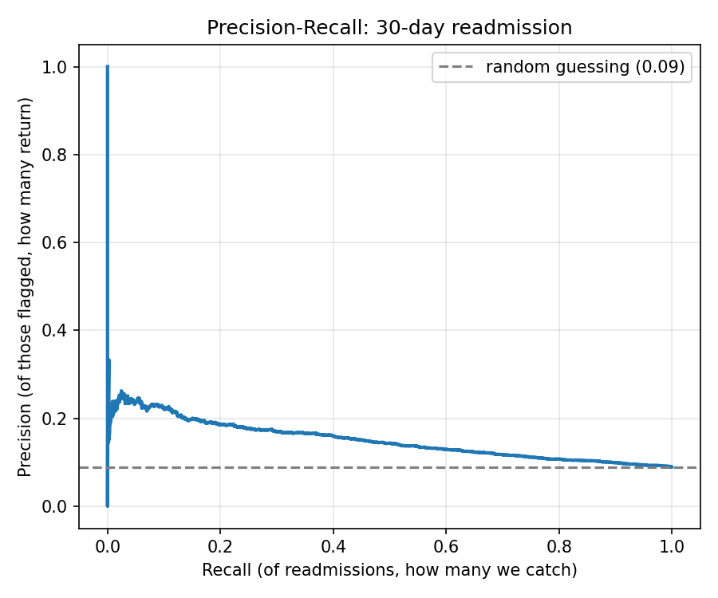
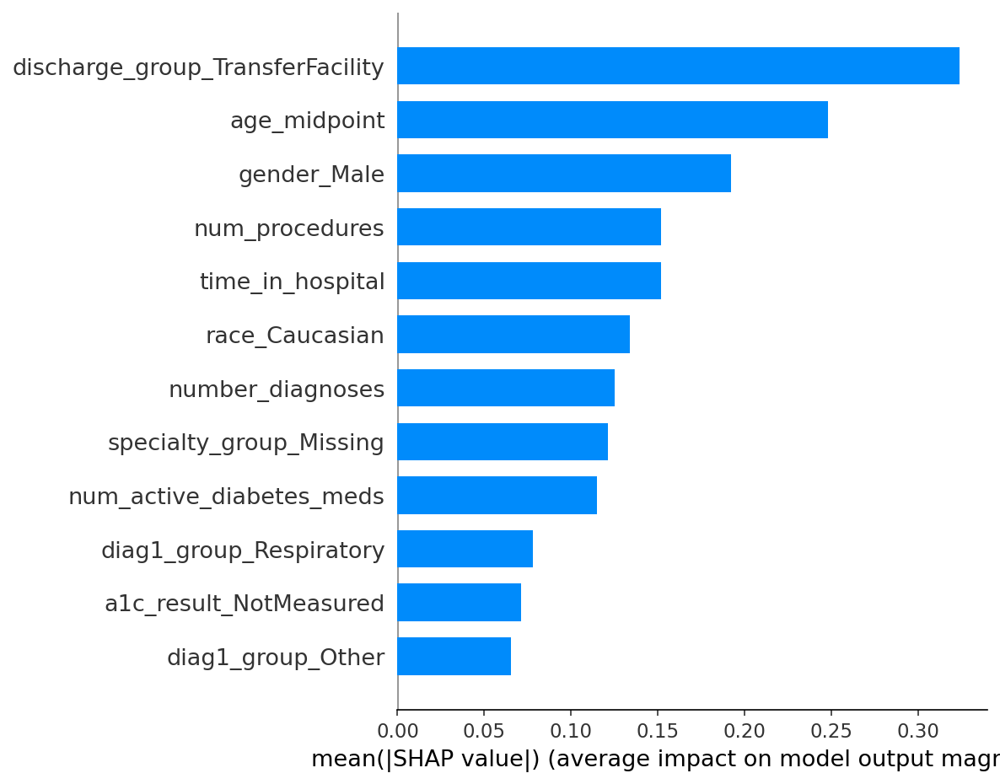

# Hospital Readmission Risk Prediction

Early identification of diabetic inpatients at high risk of 30-day readmission. Leveraging clinical data from 130 U.S. hospitals to flag at-risk patients at discharge 
and enable proactive care-management interventions to reduce readmissions and cost.

## Dataset

[Diabetes 130-US Hospitals for years 1999–2008 — UCI Machine Learning Repository](https://archive.ics.uci.edu/dataset/296/): 10 years of inpatient diabetic encounters across 130 US hospitals. Dataset paper: Strack et al. (2014).

Data volume:

- Raw: 101,766 rows × 50 columns
- After cleaning: 69,970 rows (one encounter per patient, death/hospice discharges removed)
- Final feature table: 69,970 rows × 30 columns
- 30-day readmission rate: 9.0% (baseline accuracy to beat: 91.0%)

## Method

1. **Exploration (Pandas)**: Found the target's true class balance, missing values hidden as `?`, and that 29.7% of rows were repeat patients
2. **Cleaning (Pandas)**: Kept one encounter per patient (first visit only) to prevent leakage; removed death/hospice discharges; recoded missing values as explicit categories rather than imputing
3. **Feature engineering (SQL/SQLite)**: Decoded admission and discharge ID codes into named groups; mapped raw ICD-9 diagnosis codes to 10 clinical categories; built ratio and prior-utilisation features
4. **Modelling (Scikit-learn, XGBoost)**: Compared Logistic Regression, Random Forest, and XGBoost, with SMOTE fitted inside the pipeline to avoid leakage
5. **Threshold tuning**: Swept the decision cut-off to fix a model that matched baseline accuracy while catching zero readmissions
6. **Explainability (SHAP)**: Ranked and directionally interpreted the top drivers of risk

## Key Results

XGBoost achieved the best ranking performance: **ROC-AUC 0.64**, in line with published benchmarks on this dataset. At the default threshold it matched the 91% baseline while catching 0% of readmissions — moving the threshold to 0.10 raised recall to **65% of all 30-day readmissions**.

| Model | Accuracy | Recall | ROC-AUC |
|---|---|---|---|
| **XGBoost** | 0.910 | 0.000 (default) → 0.649 (tuned) | **0.637** |
| Logistic Regression | 0.641 | 0.529 | 0.628 |
| Random Forest | 0.892 | 0.076 | 0.615 |

### Threshold tuning: fixing zero recall

At the default 0.5 cut-off, XGBoost predicted "no readmission" for every patient. Moving the threshold down trades precision for recall — the operating point is a resourcing decision (how many outreach calls a care team can make), not a modelling one.

### What drives readmission risk

Top drivers: discharge to a transfer facility, older age, longer stay, more diagnoses, and more active diabetes medications — a coherent picture of higher-acuity patients with complex care needs.

## Business implications

- **Care management targeting**: flag the top-risk 20–47% of discharges (depending on outreach capacity) for follow-up calls or home visits
- **Discharge planning**: patients sent to transfer/nursing facilities carry the highest risk and warrant closer discharge coordination
- **Resourcing trade-off**: the threshold is a dial, not a fixed rule — lower it to catch more readmissions at the cost of more outreach calls, or raise it to focus on the highest-confidence cases

## Tech Stack

Data processing: Python · Pandas · NumPy
Database/features: SQL (SQLite)
Modelling: Scikit-learn · XGBoost · imbalanced-learn (SMOTE)
Explainability: SHAP
Visualisation: Matplotlib

## Files

- `hospital_readmission_analysis.ipynb` — full analysis notebook (Google Colab)
- `model_comparison.csv` — accuracy/precision/recall/F1/ROC-AUC for all three models
- `threshold_sweep.csv` — precision/recall at each decision threshold
- `shap_feature_importance.csv` — ranked feature importance
- `shap_importance_bar.png` — top 12 risk drivers
- `precision_recall_curve.png` — precision-recall trade-off curve

## How to reproduce

1. Open `hospital_readmission_analysis.ipynb` in Google Colab
2. Run all cells top to bottom — the notebook downloads the dataset automatically
3. Data flows: raw CSV → cleaned table → SQL feature engineering → three trained models → threshold tuning → SHAP explainability
4. All outputs regenerate in the notebook; nothing external is required beyond internet access for the initial download

## Learnings

- **Leakage is easy to miss and expensive to ignore**: 30% of rows were repeat patients. A random train/test split would have let the model recognise individuals rather than learn risk patterns, inflating every score.
- **Accuracy lies on imbalanced data**: the best model by ROC-AUC matched the 91% baseline while catching zero readmissions at the default threshold. Recall, precision and ROC-AUC tell the real story; accuracy alone does not.
- **Domain knowledge shapes cleaning**: recoding death/hospice discharges, deciding what "missing" means for a lab test versus a demographic field, and grouping ICD-9 codes all required understanding what the data represents clinically, not just its shape.
- **The threshold is a business decision, not a modelling one**: the same trained model can catch 65% or 3% of readmissions depending purely on where the cut-off is set. Where to set it depends on care-team capacity.

## Next steps

- Fairness audit across race and gender before any real-world use — both entered the model as predictors
- Validate performance on more recent data, since care patterns have shifted since 1999–2008
- Explore a longitudinal model that uses a patient's full visit history, not just their first encounter

---

Built by Lois Opadeji | [LinkedIn](https://linkedin.com/in/loisopadeji) | [GitHub](https://github.com/loisopadeji)
